<div align="center">

```
┌──[root@cyber-ai]─[~/perfil]
│
├─$ > secure identity online...            ✔ ready
├─$ > training threat model...              ✔ active
├─$ > compiling AI defenses...               ✔ online
├─$ > reinforcing codebase...               ✔ immutable
└─$ > status: Cybersecurity + AI specialist ██████████
```

<br>

[](https://git.io/typing-svg)

</div>

---

## `$ whoami` — Sobre mí

Soy un estudiante de **Ingeniería de Sistemas** con una vocación clara: construir soluciones donde **la seguridad y la inteligencia artificial se potencian mutuamente**.

Mi enfoque combina:

- **Ciberseguridad ofensiva y defensiva**: laboratorios Red Team / Blue Team, análisis de amenazas, detección y respuesta.
- **Desarrollo de software seguro**: **Python**, **C**, **C++**, **TypeScript**, **POO** y arquitecturas robustas.
- **IA aplicada**: desarrollos con **LLMs**, automatización de procesos, análisis de logs y generación de informes inteligentes.

> Mi misión es diseñar sistemas que no solo funcionen, sino que sobrevivan y aprendan frente a ataques reales.

> *"Security is not a product, but a process."*
>
> &mdash; **Bruce Schneier**


## `$ ls ./skillset` — Habilidades principales

<div align="center">

### 🤖 AI & Automation


> Modelado de prompts · análisis de amenazas · automatización inteligente · generación de inteligencia defensiva

---

### 💻 Desarrollo & Sistemas


> Programación orientada a objetos · diseño de software seguro · optimización de rendimiento · dev & ops colaborativo

---

### 🔐 Ciberseguridad & Redes


> Hardening · análisis de tráfico · threat modeling · defensa proactiva

</div>

---

## `$ cat ./mission.txt` — Misión actual

```yaml
operator   : Iván Lastra
status     : ACTIVO
role       : Cybersecurity + AI Engineer
focus      : Software seguro, amenazas dinámicas, inteligencia defensiva, redes resilientes
skills     : Python, C, C++, TypeScript, OOP, LLMs, network security, red/blue labs
objective  : Diseñar soluciones donde la IA refuerza la seguridad y el software es confiable
roadmap    : eJPT → CEH → OSCP → Ingeniería de Sistemas Avanzada
current    : "Automatización de detección de incidentes con AI y análisis de logs en tiempo real"
```

---

## `$ ls ./highlights` — Logros destacados

<details>
<summary><b>🧠 AI + Cybersecurity Integration</b></summary>

- Creación de pipelines en **Python** para ingestión segura de datos y análisis de seguridad.
- Uso de **LLMs** para generar reportes de amenazas y recomendaciones de mitigación.
- Implementación de prototipos de monitoreo inteligente que priorizan alertas críticas.

</details>

<details>
<summary><b>🛠️ Software Seguro & Rendimiento</b></summary>

- Desarrollo en **C/C++** con enfoque en memoria segura y manejo de recursos.
- Diseño de proyectos modulares con **POO** y validaciones sólidas.
- Integración de soluciones basadas en **TypeScript** para interfaces y servicios confiables.

</details>

<details>
<summary><b>🛡️ Red Team / Blue Team Lab</b></summary>

- Laboratorio propio con segmentación, monitoreo y simulación de ataques.
- Hardening de servidores, automatización de defensas y análisis de vectores de riesgo.
- Iteración continua: identificar, explotar, detectar y mitigar.

</details>

---

## `$ ./metrics` — GitHub pulse

<div align="center">


<br><br>


<br><br>


</div>

---

## `$ tail -f ./activity.log` — Actividad reciente

<!--START_SECTION:activity-->
1. ℹ️ Assigned issue [#19](https://github.com/CapituloJaverianoACM/UniApp-ACM/issues/19) in [CapituloJaverianoACM/UniApp-ACM](https://github.com/CapituloJaverianoACM/UniApp-ACM)
2. 🔒 Closed issue [#34](https://github.com/CapituloJaverianoACM/UniApp-ACM/issues/34) in [CapituloJaverianoACM/UniApp-ACM](https://github.com/CapituloJaverianoACM/UniApp-ACM)
3. 🎉 Merged PR [#37](https://github.com/CapituloJaverianoACM/UniApp-ACM/pull/37) in [CapituloJaverianoACM/UniApp-ACM](https://github.com/CapituloJaverianoACM/UniApp-ACM)
4. 💪 Opened PR [#37](https://github.com/CapituloJaverianoACM/UniApp-ACM/pull/37) in [CapituloJaverianoACM/UniApp-ACM](https://github.com/CapituloJaverianoACM/UniApp-ACM)
5. ℹ️ Assigned issue [#34](https://github.com/CapituloJaverianoACM/UniApp-ACM/issues/34) in [CapituloJaverianoACM/UniApp-ACM](https://github.com/CapituloJaverianoACM/UniApp-ACM)
<!--END_SECTION:activity-->


---

## `$ cat ./contact.cfg` — Contacto

<div align="center">

[](https://www.linkedin.com/in/ivans-lastra/?skipRedirect=true)
[](mailto:ivansantiagolastra1408@gmail.com)
[](https://ivanlastra.dev)

</div>

---

<div align="center">



</div>
